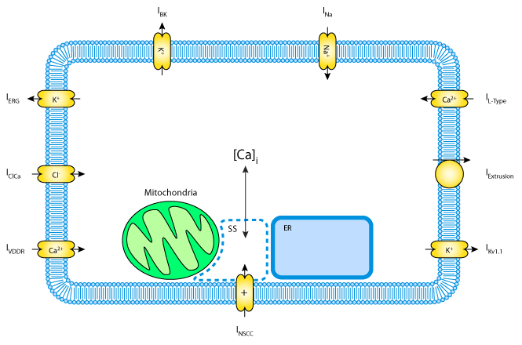

Original Paper
==============

:Original publication:  "Quantitative cellular description of gastric slow wave activity"

:DOI: https://doi.org/10.1152/ajpgi.00528.2007

Model status
=============
The original CellML model is divided into eight sub-modules presenting a modularized version of various ion channels.

Model Summary
==============
Interstitial cells of Cajal (ICC) are responsible for the spontaneous and
omnipresent electrical activity in the stomach. A quantitative description of
the intracellular processes whose coordinated activity is believed to generate electrical slow waves has been developed and is presented by authors.
In line with recent experimental evidence, the model describes how the interplay
between the mitochondria and the endoplasmic reticulum in cycling intracellular Ca2+ provides the primary regulatory signal for the initiation of the slow wave.

The model is implemented using a Hodgkin-Huxley type formulation. The cell membrane lipid bilayer is represented as a capacitance (Cm),
and the ion channels in the membrane are represented as conductance. The change in the transmembrane potential (Vm) over time depends on
is the sum of the individual ion currents through each class of ion channel in the cell current:

:math:` \frac{dVm}{dt} = - \frac{I_{tot}}{C_{m}}`.

Where there are 9 different ion channels as below:

Ether-a-go-go potassium channels: I-ERG,

Background potassium channels: Ib,

Ca2+/Na+ exchangers(NCX): ICaSR,

L-Type Ca2+ voltage-gated channels (long lasting): ICa-L,

T-Type Ca2+ voltage-gated channel (DHP-Resistant Conductance, VDDR): IVDDR,

Delayed-Rectifying potassium channels: Ikv11,

Non-selective cation channels: INSCC

Sodium channels: INKCC.

In each folder, there are two CellML files: one related to the experiment and the other one the main CellML code for the selected ion channel.
